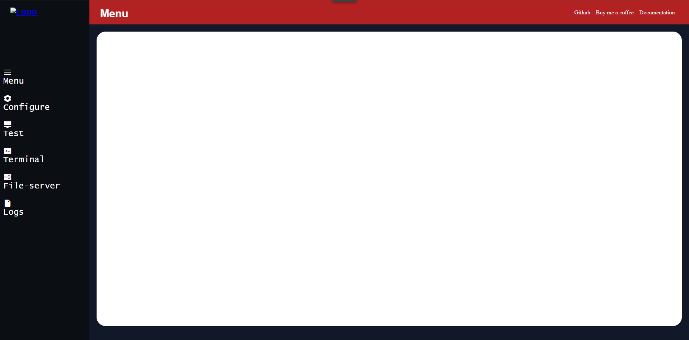

## Legal Disclaimer

This software is provided **strictly for educational, research, and ethical practice purposes only**.

-  **Do NOT use this tool on any system you do not own or have explicit permission to test.**
-  **Unauthorized use of this software may be illegal and is strictly prohibited.**
-  **The author takes no responsibility for any damage, data loss, or legal consequences resulting from misuse.**

By using this software, you agree to use it **ethically, lawfully**, and in **controlled environments such as virtual labs, or testing networks with legal permission**.

This tool is intended to help raise awareness and understanding of security threats — **not to promote or enable criminal activity**.

> **If anything is still unclear, read the full [Code of Conduct](CODE_OF_CONDUCT.md). The author is not responsible for misuse or misunderstanding of this software.**

## Information

This branch will focus on transforming CobaltLock into a fully functional, ethical full-stack C2 (Command and Control) server, utilizing the following technologies:

  

Features planned to be implemented 

- User Authentication: Implementing a secure login system using (HttpOnly cookies) to access the control panel.
- Basic payload creation with simple encoding (Base 64)
- A logo/icon for the website

## Current Menu

This is the basic version for now and may change in future updates. If you have any suggestions or feedback, feel free to reach out through GitHub Issues
. Just create a new issue, and I'll respond as soon as I can.

Looking forward to your thoughts!

  

